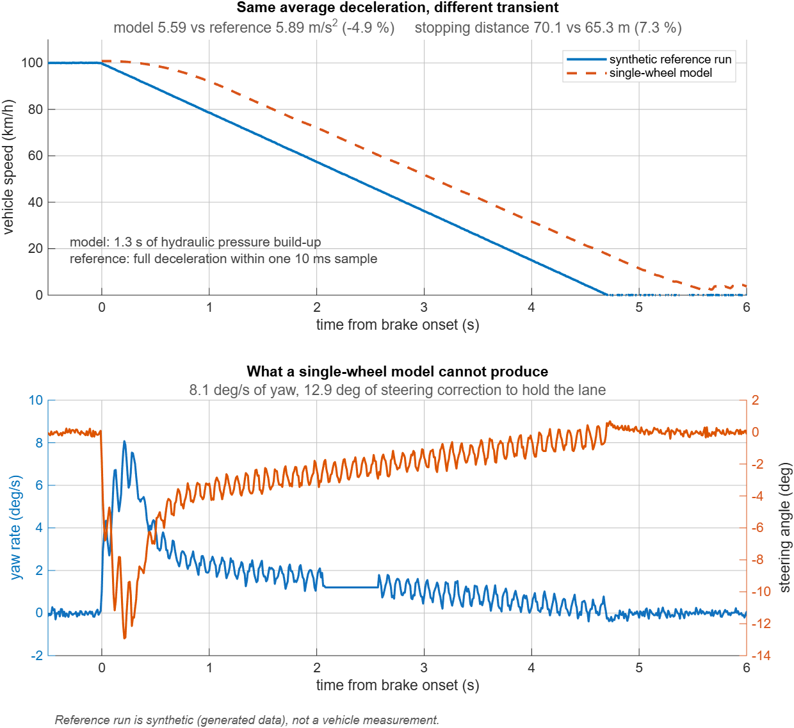

# ABS braking: model scope, not model validation

A single-wheel ABS model (MathWorks `sldemo_absbrake`) compared against a
reference braking run, to find out **which questions the model can answer and
which it cannot**.

This is not a validation. Read [Scope and honesty](#scope-and-honesty) before
using any number from here.



---

## What was found

### 1. The shipped example computes one wheel's share, not the vehicle

Reading the block diagram rather than the documentation:

```
wheel slip  ->  mu-slip friction curve  ->  x m*g/4  ->  tyre force
                                            (load on ONE wheel)

tyre force  ->  x 1/m  ->  vehicle deceleration
                (mass of the WHOLE car)
```

The normal load is one wheel's. The mass it is divided by is the whole car's.
Follow the path and the ceiling is `mu*g/4`, which is 2.45 m/s2 (0.25 g) on dry
asphalt.

The example is not wrong. It is a single-wheel model and its output is one
wheel's contribution to the whole vehicle. Nothing in the documentation says
so, and reading that output as "vehicle deceleration" produces a number that is
four times too small while still carrying the right units.

`absbrake_surface.m` sets the load term to `m*g` instead, which assumes the
other three wheels do what this one does. That is the correct assumption in a
straight line and it is wrong in a turn.

### 2. Actuator and controller are coupled

With the shipped Hydraulic Lag numerator of 100, ABS first engages about 7 s
into the stop, which is longer than the stop itself. The controller cannot
correct faster than the hydraulics can raise pressure.

**This is a knob, not a result.** The value used here (1400) was raised until
ABS engaged inside the braking window. No measurement supports that number, and
the transient of the model therefore cannot be compared against anything.

### 3. The model has no yaw degree of freedom

On a mu-split surface the single-wheel model reproduces the stopping distance
by averaging the two friction coefficients. It cannot produce the yaw moment
that is the actual hazard, because there is no equation in it from which a yaw
rate could come. The lower panel of the figure shows what the model is blind
to, not what it gets wrong.

### 4. The scalar error is not the error in metres

| | model | reference |
|---|---|---|
| deceleration | 5.59 m/s2 (0.57 g) | 5.89 m/s2 (0.60 g) |
| stopping distance | 70.1 m | 65.3 m |
| rise to full deceleration | 1.27 s | within one 10 ms sample |
| peak yaw rate | not modelled | 8.1 deg/s |
| steering correction | not modelled | 12.9 deg |

A deceleration 4.9 % low becomes a distance 7.3 % long. Distance goes with
`v0^2 / 2a`, so the deceleration gap (+5.2 % of distance) compounds with the
2.9 % difference in initial speed, squared. 1.052 x 1.031 = 1.085.
Nothing else is hidden in that gap.

---

## Method notes

- **The model does not publish vehicle speed.** It publishes travelled distance
  `Sd`, and the derivative of distance is speed. Checked against the initial
  condition: `v(1) = 28.0000` exactly.
- **The slope is fitted on the full-braking window only** (`0.3*v0 < v <
  0.9*v0`), discarding pressure build-up and the tail. The model never comes to
  a complete stop, so "initial speed over total time" is not a valid estimator
  and gives nonsense.
- **The same estimator and the same window are applied to both sides.**
  Comparing a fitted slope against a total-time average would flatter one of
  them.
- **Times below the sampling interval are not reported as numbers.** The
  reference run reaches full deceleration inside one 10 ms sample; that is the
  measurement resolution, not a measured 0 ms.

---

## Scope and honesty

- **The reference run is synthetic and is not redistributed.** It comes from a
  data generator, not from a vehicle, and it is listed in `.gitignore`. Its ABS ripple is a fixed sinusoid rather than
  a controller reacting to slip, its friction coefficient is constant, and
  there is no load transfer. Its yaw channel is written, not computed.
- Comparing a computation against generated data **validates nothing about a
  real vehicle**. What it does is expose the scope of the model.
- The Hydraulic Lag value is unjustified, as stated above. So is the
  generator's instantaneous deceleration step. Neither transient is anchored to
  a measurement, so the difference between them is not a finding.
- What would make this a validation: one real braking run, logged from the
  vehicle bus.

---

## Files

| file | what it does |
|---|---|
| `absbrake_surface.m` | configures and runs the model for one surface (`dry`, `wet`, `splitmu`, `ice`), sets the load term to `m*g`, fixes the pressure ramp, and measures deceleration, distance and ABS engagement |
| `compare_splitmu.m` | runs the model on mu-split, loads the reference run, aligns both on brake onset, and produces the figure |
| `run01_splitmu.csv` | synthetic reference run, 100 Hz, 12 s, 11 channels. **Not in this repository** |

## Reproducing

MATLAB Online (free tier) with Simulink.

**Everything that matters here reproduces without the reference run.** The
scope finding, the measurement method and the model figures come from the
shipped MathWorks example alone:

```matlab
bdclose all; clear;
sldemo_absbrake;
absbrake_surface("dry")        % and "wet", "splitmu", "ice"
```

Compare the printed deceleration with and without the `m*g` correction and the
factor of four is there, on any surface.

`compare_splitmu` additionally needs `run01_splitmu.csv`, which is not
published. The figure it produces is committed as
`model_vs_reference_splitmu.png` so the result can be read without rerunning
it.

`sim` is called with `"ReturnWorkspaceOutputs", "on"`: without it this model
returns the time vector instead of the logged signals.
